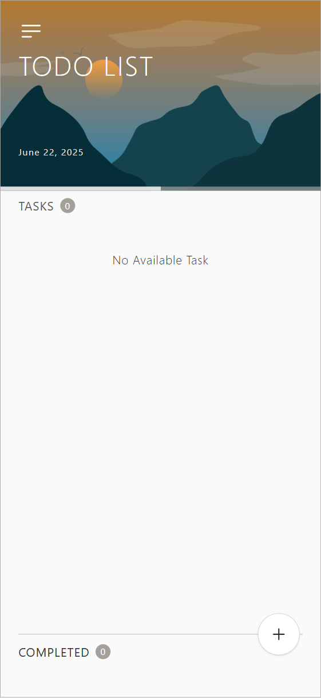
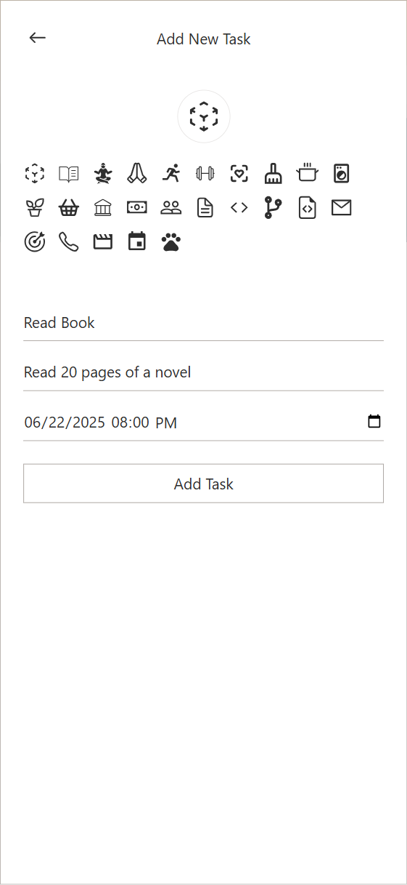
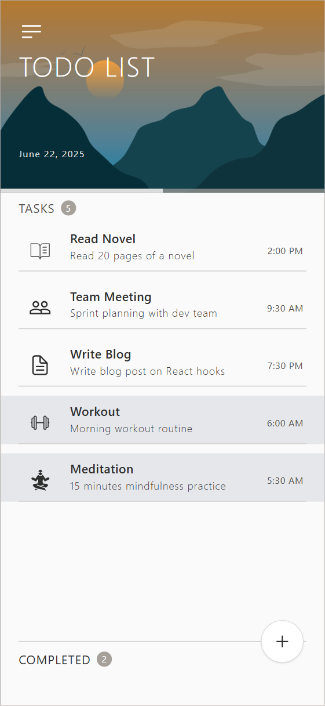
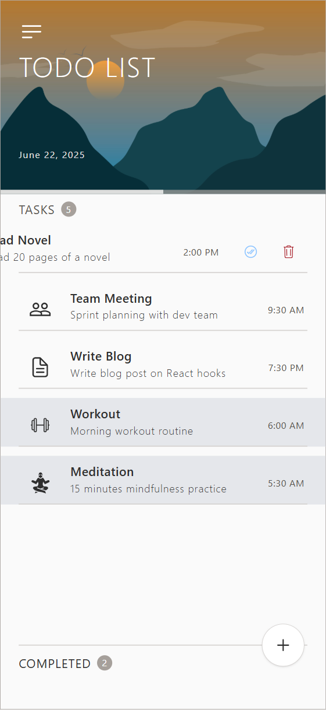

# ✔️ Awesome TODO App

Welcome to the Awesome TODO App! This application helps you manage your tasks efficiently and stay organized. Whether you're a busy professional or a student, this TODO app has got you covered.

## 🚀 Features

- Create/Read/Update/Delete todos
- Mark/Unmark todos as competed
- Add a filter to filter completed todos

### 🏃 Taking in the challenge?

Please follow these steps:

- Fork the repository.
- Create a new branch for your attempt: `git checkout -b <your_username>`.
- Commit your changes
- Push to your branch: `git push origin <your_username>`.
- Submit a pull request.

---

# 📝 To-Do List App

This is a full-stack To-Do List web application built using:

- 🌐 **Frontend:** React with TypeScript (created using Vite)
- 🐍 **Backend:** Django REST Framework

## ✨ Features

- ✅ Create, Read, Update, and Delete (CRUD) todo tasks
- 📝 Mark or Unmark tasks as **completed**
- 🔍 Filter tasks based on **completed** and **incomplete** status

---

## 🧭 How to Use

1. **➕ Create a Task**

   - Click the **plus (+)** icon on the home page to go to the **Create Task** page.
   - Fill in the task details:
     - **Title**
     - **Description**
     - **Choose an Icon**
     - **Select Date & Time**
   - Click the **Create Task** button to save it.

2. **🔙 Navigate Back**

   - Use the **Back** button in the top-left corner to return to the task list page.

3. **📋 Manage Tasks**

   - On the **To-Do Task** page, click the task to:
     - View toggle button to **mark or Unmark tasks as completed**
     - View delete button to **delete the task** from this view.

4. **🔍 Filter Tasks**
   - Task are filtered:
     - **Incomplete** tasks are show at **top**
     - **Completed** tasks are shown **below**

---

## 📦 Prerequisites

- [Docker Desktop](https://www.docker.com/products/docker-desktop) installed and running
- Git installed

---

## 🚀 Getting Started

Follow these steps to run the full project:

### 1. Clone the Repository

```bash
git clone https://github.com/konnectkraft-dev/Todo-spec.git
cd Todo-spec
docker-compose up --build
```

## Access the App

Frontend (React): http://localhost:5173
Backend (Django API): http://localhost:8000

## 🖼️ Screenshot





